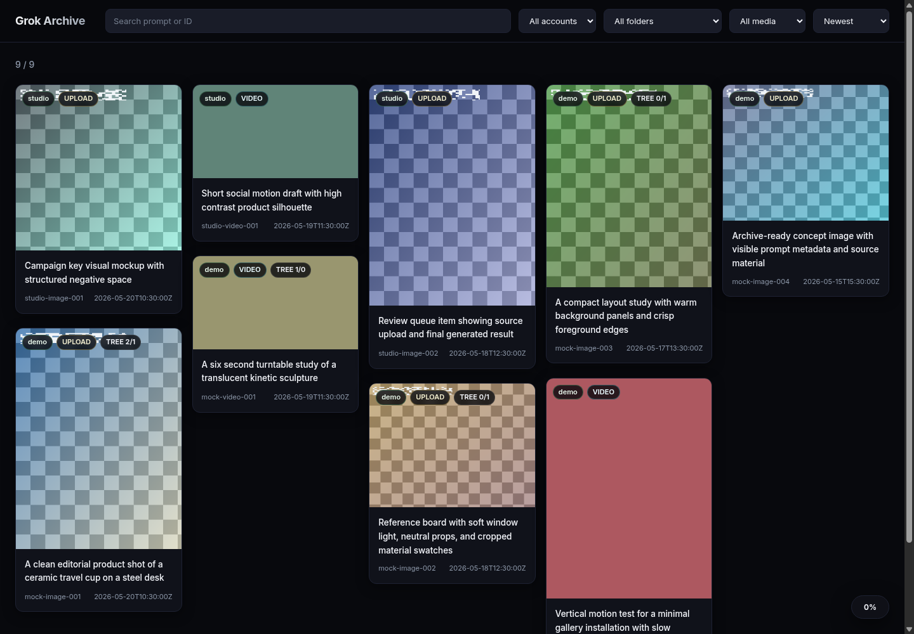
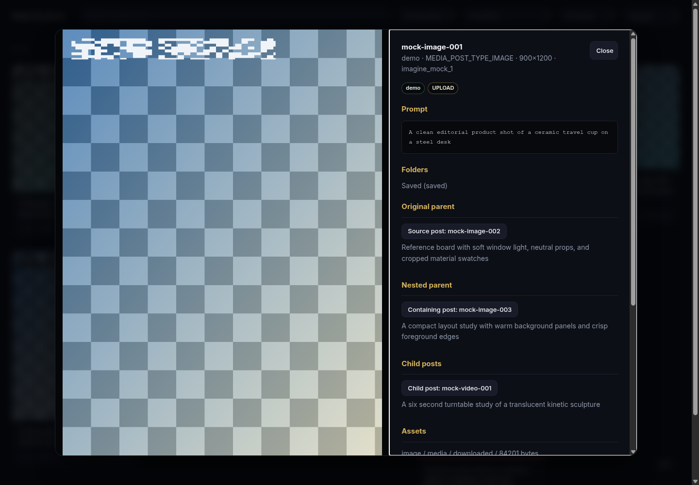

# Grok Imagine Archive

**English** | [简体中文](docs/zh-CN/README.md)

`grok-imagine-archive` is a local archive tool for Grok Imagine Saved/Liked assets. It
uses the JSON APIs behind the official Web interface in read-only mode, then
stores every enumerable image, video, thumbnail, prompt, raw JSON payload, folder
relationship, and derivation relationship in a local archive. It also includes a
read-only Web UI for browsing the archive offline.

This project is designed as a maintainable archive system, not a one-off export
script:

- Remote enumeration uses cursor pagination instead of first-screen DOM state, so
  it is not misled by lazy loading in the Saved page.
- Local storage uses SQLite plus a file archive, with state tracking, retry
  support, hash verification, and read-only browsing.
- Each account is isolated, which makes the tool suitable for long-running
  incremental syncs rather than a disposable one-time dump.

## Screenshots

The screenshots below are generated from mock data, not from a real Grok account
or private archive.





## Documentation

If you are returning to this project after a long break, read these in order:

1. [Product And Usage Overview](#product-and-usage-overview)
2. [Product Design](docs/product-design.md)
3. [Architecture](docs/architecture.md)
4. [Examples](docs/examples.md)
5. [Operations](docs/operations.md)

## Product And Usage Overview

### What Problem It Solves

The Grok Imagine Saved page is lazy-loaded. When an account has many assets,
browser scrolling, screenshots, or manual saving are hard to control and do not
reliably preserve:

- original media, thumbnails, videos, and other media variants
- `prompt`, `originalPrompt`, model name, resolution, and related metadata
- the relationship between posts and folders
- derivation chains such as original posts, child posts, and input media
- whether an archive run is complete, which files failed, and whether retrying is
  safe

`grok-imagine-archive` turns those remote assets into a local library that can be
resynced, verified, and browsed.

### Core Commands

- `auth check`
  Checks whether the local account configuration can still access the Grok API.
- `sync`
  Enumerates remote lists, writes posts/assets/folders/edges, and optionally
  downloads media.
- `download`
  Downloads only assets that are still `pending` or `failed` in SQLite, without
  re-enumerating remote lists.
- `status`
  Prints the current archive size and the latest sync status for an account.
- `verify`
  Recomputes file hashes and sizes to verify archive consistency.
- `web`
  Starts a local read-only Web UI for browsing archived content.

### Full Sync Semantics

`sync --full` does not mean "capture one rendered page." It means:

1. call `/rest/media/folder/list`
2. call `/rest/media/post/list` for the liked/saved root list until
   `nextCursor == ""`
3. call `/rest/media/post/list` again for each folder until every folder cursor
   is exhausted
4. recursively extract assets from `images`, `videos`, `childPosts`,
   `inputMediaItems`, `thumbnailImageUrl`, and nested source URL fields
5. call `/rest/media/post/folders` for known posts and save folder membership
6. download all pending media and record hash, size, retry state, and failures

This solves the API-level completeness problem rather than the frontend
"scroll to the bottom" problem.

## Quick Start

### 1. Prepare Configuration

Copy the example config:

```bash
cp config/accounts.example.toml config/accounts.toml
```

Get the values from the same browser session that can open your Grok saved or
liked images:

1. Open `https://grok.com/` in Chrome or Edge and sign in.
2. Open the Grok Imagine saved or liked page once, then keep that tab open.
3. Right-click the page and choose **Inspect**. You can also press `F12`, or
   `Command+Option+I` on macOS.
4. In Developer Tools, open **Application**. If you cannot see it, click the
   `>>` tab menu. In Firefox, the matching tab is **Storage**.
5. In the left sidebar, open **Cookies** > `https://grok.com`.
6. Find the cookie named `sso`. Copy only its **Value** field into `sso`.
   Do not include `sso=`.
7. Find the cookie named `cf_clearance`. Copy only its **Value** field into
   `cf_clearance`. Do not include `cf_clearance=`. If it is not listed, leave
   `cf_clearance = ""` first and run `auth check`; if Cloudflare blocks the
   check, refresh Grok in the browser and look again.
8. Open the **Console** tab, type `navigator.userAgent`, and press Enter.
   Copy the text inside the quotes into `user_agent`.
9. Set `browser` to the Chrome major version from the user agent. For example,
   if the user agent contains `Chrome/136...`, use `browser = "chrome136"`.
   If unsure, keep the example value for the first check.
10. Leave `proxy = ""` unless the browser session used the same proxy.

Never copy the full `Cookie:` request header, and never paste cookie values into
GitHub issues, Reddit posts, screenshots, or logs.

Minimal config example:

```toml
[[accounts]]
alias = "demo"
enabled = true
sso = "..."
cf_clearance = "..."
user_agent = "Mozilla/5.0 ..."
browser = "chrome136"
proxy = ""
```

Notes:

- `config/accounts.toml`, `samples/`, and `archive/` are ignored by git.
- Never commit cookies, tokens, or HAR samples, and never paste them into logs.
- You can override the default paths with environment variables:

```bash
export GROK_IMAGINE_ARCHIVE_CONFIG=/secure/accounts.toml
export GROK_IMAGINE_ARCHIVE_ROOT=/data/grok-archive
```

### 2. Check Connectivity

```bash
uv run grok-imagine-archive auth check --account demo
```

### 3. Run A Small Trial Sync

```bash
uv run grok-imagine-archive sync --account demo --limit 20
uv run grok-imagine-archive verify --account demo
```

### 4. Run The Full Sync

```bash
uv run grok-imagine-archive sync --account demo --full --download-concurrency 8
uv run grok-imagine-archive verify --account demo
```

### 5. Browse The Archive

```bash
GROK_IMAGINE_ARCHIVE_WEB_TOKEN='replace-with-long-random-token' \
  uv run grok-imagine-archive web --account demo --host 127.0.0.1 --port 7860
```

First browser visit:

```text
http://127.0.0.1:7860/?token=your-access-token
```

## Local Archive Layout

```text
archive/accounts/{alias}/
  index.sqlite
  media/images/
  media/videos/
  thumbs/
  metadata/posts/
  metadata/pages/
  metadata/failures/
  logs/
```

Directory roles:

- `index.sqlite`
  Structured index for posts, assets, folders, post edges, and sync runs.
- `media/images/`, `media/videos/`
  Downloaded primary media files.
- `thumbs/`
  Thumbnails and preview images.
- `metadata/posts/`
  Raw JSON snapshots for individual posts.
- `metadata/pages/`
  Raw JSON API page responses for audit and replay.
- `metadata/failures/`
  Failure manifests and troubleshooting artifacts.
- `logs/`
  Local runtime logs such as background Web UI logs.

## Code Layout

Most implementation lives in `src/grok_imagine_archive/`:

- `cli.py`
  Command entry points and argument parsing.
- `client.py`
  Grok API client, request headers, cookies, and browser impersonation.
- `sync.py`
  Full and limited sync orchestration.
- `extract.py`
  Recursive post traversal and asset URL extraction.
- `archive.py`
  SQLite schema, file persistence, and download state.
- `download.py`
  Concurrent pending-asset downloader.
- `verify.py`
  Hash recalculation and archive integrity checks.
- `web.py`
  Read-only Web API and single-page browser UI.

See [Architecture](docs/architecture.md) for the module responsibilities, data
flow, and table design.

## Health Criteria

After an archive run, the minimum healthy state is:

- `status` reports `failed=0`
- `status` reports `missing=0`
- `verify` reports `hash_mismatches=0`
- the latest `sync_runs.status` is `ok`, or a `partial` state that you can
  explain

Common checks:

```bash
uv run grok-imagine-archive status --account demo
uv run grok-imagine-archive verify --account demo
```

If a temporary download failure occurs:

```bash
uv run grok-imagine-archive download --account demo --concurrency 8
uv run grok-imagine-archive verify --account demo
```

## Safety Boundaries

- The tool is read-only against Grok. It does not delete or mutate cloud assets.
- `sync` and `download` use an account-scoped write lock to avoid corrupting an
  archive with concurrent writers.
- The Web UI opens SQLite in read-only mode.
- Media file access is constrained to the account archive directory to prevent
  path traversal.
- The archive may contain private media, prompts, and input assets; treat it as
  sensitive data.

## Further Reading

- [Product Design](docs/product-design.md)
  Product goals, user scenarios, interaction design, and tradeoffs.
- [Architecture](docs/architecture.md)
  Technical architecture, data model, key flows, and extension points.
- [Examples](docs/examples.md)
  Command examples, output examples, and common workflows.
- [Operations](docs/operations.md)
  Operations, deployment, health checks, and troubleshooting.
